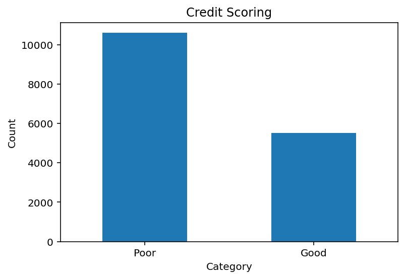

## Introduction

In this project we applied 3 machine learning classification algorithms to build model to predict Credit scores. The dataset we used for this project is Credit scoring dataset from [kaggle](https://www.kaggle.com/datasets/parisrohan/credit-score-classification).

### Importing Neccessary Libraries

Following libraries are used for this project

::: {.cell execution_count=1}
```` { .cell-code}
```{{python}}
import pandas as pd
import re
import numpy as np
from sklearn import preprocessing
from sklearn.preprocessing import scale
import os
import matplotlib.pyplot as plt
from sklearn.model_selection import train_test_split
```

````
:::


### Dataset

Initial dimension of the data had 100'000 rows and 28 variables. After removing some unique identification variables we are going to work on are:

-   "Month" - Month of the year
-   "Age" - Age of the person, We limited it into 14+56
-   "Occupation" - Occupation of the person, 16 factor
-   "Annual_Income" - Annual income of the person, continuous variable
-   "Monthly_Inhand_Salary" - Monthly salary, continuous variable
-   "Num_Bank_Accounts" - Num of bank accounts the person holds
-   "Num_Credit_Card" - Num of credit card the person holds
-   "Interest_Rate" - Interest rate on credit card
-   "Num_of_Loan" - Num of loans from the bank
-   "Type_of_Loan" - Type of loan
-   "Delay_from_due_date" - Average number of days delayed from the payment date
-   "Num_of_Delayed_Payment" - Average number of payments delayed by a person
-   "Changed_Credit_Limit" - Percentage change in credit card limit
-   "Num_Credit_Inquiries" - number of credit card inquiries
-   "Credit_Mix" - Classification of the mix of credits
-   "Outstanding_Debt" - remaining debt to be paid (in USD)
-   "Credit_Utilization_Ratio" - utilization ratio of credit card
-   "Credit_History_Age" - age of credit history of the person
-   "Payment_of_Min_Amount" - whether only the minimum amount was paid by the person
-   "Total_EMI_per_month" - monthly EMI payments (in USD)
-   "Amount_invested_monthly" - monthly amount invested by the customer (in USD)
-   "Payment_Behaviour" - payment behavior of the customer
-   "Monthly_Balance" - monthly balance amount of the customer (in USD)
-   "Credit_Score" - bracket of credit score (Poor, Standard, Good)

Our target variable Credit_Score has 3 classes, but we only took **"Poor"** and **"Good"** categories to further analysis.

::: {.cell execution_count=2}
```` { .cell-code}
```{{python}}
#| warning: false
os.getcwd()
credit_score=pd.read_csv('train.csv', )
print(credit_score.shape)
credit_score.head()
```

````

::: {.cell-output .cell-output-stdout}
```
(100000, 28)
```
:::

::: {.cell-output .cell-output-display execution_count=62}

```{=html}
<div>
<style scoped>
    .dataframe tbody tr th:only-of-type {
        vertical-align: middle;
    }

    .dataframe tbody tr th {
        vertical-align: top;
    }

    .dataframe thead th {
        text-align: right;
    }
</style>
<table border="1" class="dataframe">
  <thead>
    <tr style="text-align: right;">
      <th></th>
      <th>ID</th>
      <th>Customer_ID</th>
      <th>Month</th>
      <th>Name</th>
      <th>Age</th>
      <th>SSN</th>
      <th>Occupation</th>
      <th>Annual_Income</th>
      <th>Monthly_Inhand_Salary</th>
      <th>Num_Bank_Accounts</th>
      <th>...</th>
      <th>Credit_Mix</th>
      <th>Outstanding_Debt</th>
      <th>Credit_Utilization_Ratio</th>
      <th>Credit_History_Age</th>
      <th>Payment_of_Min_Amount</th>
      <th>Total_EMI_per_month</th>
      <th>Amount_invested_monthly</th>
      <th>Payment_Behaviour</th>
      <th>Monthly_Balance</th>
      <th>Credit_Score</th>
    </tr>
  </thead>
  <tbody>
    <tr>
      <th>0</th>
      <td>0x1602</td>
      <td>CUS_0xd40</td>
      <td>January</td>
      <td>Aaron Maashoh</td>
      <td>23</td>
      <td>821-00-0265</td>
      <td>Scientist</td>
      <td>19114.12</td>
      <td>1824.843333</td>
      <td>3</td>
      <td>...</td>
      <td>_</td>
      <td>809.98</td>
      <td>26.822620</td>
      <td>22 Years and 1 Months</td>
      <td>No</td>
      <td>49.574949</td>
      <td>80.41529543900253</td>
      <td>High_spent_Small_value_payments</td>
      <td>312.49408867943663</td>
      <td>Good</td>
    </tr>
    <tr>
      <th>1</th>
      <td>0x1603</td>
      <td>CUS_0xd40</td>
      <td>February</td>
      <td>Aaron Maashoh</td>
      <td>23</td>
      <td>821-00-0265</td>
      <td>Scientist</td>
      <td>19114.12</td>
      <td>NaN</td>
      <td>3</td>
      <td>...</td>
      <td>Good</td>
      <td>809.98</td>
      <td>31.944960</td>
      <td>NaN</td>
      <td>No</td>
      <td>49.574949</td>
      <td>118.28022162236736</td>
      <td>Low_spent_Large_value_payments</td>
      <td>284.62916249607184</td>
      <td>Good</td>
    </tr>
    <tr>
      <th>2</th>
      <td>0x1604</td>
      <td>CUS_0xd40</td>
      <td>March</td>
      <td>Aaron Maashoh</td>
      <td>-500</td>
      <td>821-00-0265</td>
      <td>Scientist</td>
      <td>19114.12</td>
      <td>NaN</td>
      <td>3</td>
      <td>...</td>
      <td>Good</td>
      <td>809.98</td>
      <td>28.609352</td>
      <td>22 Years and 3 Months</td>
      <td>No</td>
      <td>49.574949</td>
      <td>81.699521264648</td>
      <td>Low_spent_Medium_value_payments</td>
      <td>331.2098628537912</td>
      <td>Good</td>
    </tr>
    <tr>
      <th>3</th>
      <td>0x1605</td>
      <td>CUS_0xd40</td>
      <td>April</td>
      <td>Aaron Maashoh</td>
      <td>23</td>
      <td>821-00-0265</td>
      <td>Scientist</td>
      <td>19114.12</td>
      <td>NaN</td>
      <td>3</td>
      <td>...</td>
      <td>Good</td>
      <td>809.98</td>
      <td>31.377862</td>
      <td>22 Years and 4 Months</td>
      <td>No</td>
      <td>49.574949</td>
      <td>199.4580743910713</td>
      <td>Low_spent_Small_value_payments</td>
      <td>223.45130972736786</td>
      <td>Good</td>
    </tr>
    <tr>
      <th>4</th>
      <td>0x1606</td>
      <td>CUS_0xd40</td>
      <td>May</td>
      <td>Aaron Maashoh</td>
      <td>23</td>
      <td>821-00-0265</td>
      <td>Scientist</td>
      <td>19114.12</td>
      <td>1824.843333</td>
      <td>3</td>
      <td>...</td>
      <td>Good</td>
      <td>809.98</td>
      <td>24.797347</td>
      <td>22 Years and 5 Months</td>
      <td>No</td>
      <td>49.574949</td>
      <td>41.420153086217326</td>
      <td>High_spent_Medium_value_payments</td>
      <td>341.48923103222177</td>
      <td>Good</td>
    </tr>
  </tbody>
</table>
<p>5 rows × 28 columns</p>
</div>
```

:::
:::


### Data Preprocessing

We prepared the data set for further analysis step by removing rows with missing values, transforming character variables into categorical/factor variables, and numeric variables and standardized it and removing outliers.

::: {.cell execution_count=3}
```` { .cell-code}
```{{python}}
data=credit_score.drop(['ID','Customer_ID','Name','SSN'], axis=1)
data = data.dropna(axis=0, how='any')
data["Month"] = data["Month"].astype("category")
data['Age']=data['Age'].str.replace('_', '')
data['Age']=data['Age'].astype('int')
data=data.loc[(data['Age'] >= 15) & (data['Age'] <= 65)]
data.Occupation=data.Occupation.astype('category')
data['Annual_Income']=data['Annual_Income'].str.replace('_', '')
data.Annual_Income=data.Annual_Income.astype('float')
data['Num_of_Loan']=data['Num_of_Loan'].str.replace('_', '')
data.Num_of_Loan=data.Num_of_Loan.astype('int')
data=data.loc[(data['Num_of_Loan'] >= 0) & (data['Num_of_Loan'] <= 10)]
data.Num_of_Loan = scale(data.Num_of_Loan)

data['auto'] = np.where(data['Type_of_Loan'].str.contains("Auto"),1,0)
data['debt_consolidation'] = np.where(data['Type_of_Loan'].str.contains("Debt Consolidation"),1,0)
data['mortgage'] = np.where(data['Type_of_Loan'].str.contains("Mortgage"),1,0)
data['home_equity'] = np.where(data['Type_of_Loan'].str.contains("Home Equity"),1,0)
data['personal'] = np.where(data['Type_of_Loan'].str.contains("Personal"),1,0)
data['student'] = np.where(data['Type_of_Loan'].str.contains("Student"),1,0)
data['credit_builder'] = np.where(data['Type_of_Loan'].str.contains("Credit-Builder"),1,0)
data['payday'] = np.where(data['Type_of_Loan'].str.contains("Payday"),1,0)
data['not_specified'] = np.where(data['Type_of_Loan'].str.contains("Not Specified"),1,0)
data=data.drop(['Type_of_Loan'], axis=1)

data['Num_of_Delayed_Payment']=data['Num_of_Delayed_Payment'].str.replace('_', '')
data.Num_of_Delayed_Payment=data.Num_of_Delayed_Payment.astype('int')
data=data.loc[(data['Num_of_Delayed_Payment'] >= 0) & (data['Num_of_Delayed_Payment'] <= 30)]
data.Num_of_Delayed_Payment = scale(data.Num_of_Delayed_Payment)
data.Changed_Credit_Limit=pd.to_numeric(data.Changed_Credit_Limit, errors='coerce')
data.Changed_Credit_Limit = scale(data.Changed_Credit_Limit)
data.Num_Credit_Inquiries=pd.to_numeric(data.Num_Credit_Inquiries, errors='coerce')
data=data.loc[(data['Num_Credit_Inquiries'] >= 0) & (data['Num_Credit_Inquiries'] <= 1060)]
data.Num_Credit_Inquiries = scale(data.Num_Credit_Inquiries)
data.Credit_Mix=data.Credit_Mix.astype('category')
data.Outstanding_Debt=pd.to_numeric(data.Outstanding_Debt, errors='coerce')
data.Outstanding_Debt = scale(data.Outstanding_Debt)
data.Payment_of_Min_Amount=data.Payment_of_Min_Amount.astype('category')
data.Amount_invested_monthly=pd.to_numeric(data.Amount_invested_monthly, errors='coerce')
data.Amount_invested_monthly = scale(data.Amount_invested_monthly)
data.Payment_Behaviour=data.Payment_Behaviour.astype('category')
data.Monthly_Balance=pd.to_numeric(data.Monthly_Balance, errors='coerce')
data.Monthly_Balance = scale(data.Monthly_Balance)
data.Monthly_Inhand_Salary = scale(data.Monthly_Inhand_Salary)
data.Delay_from_due_date = scale(data.Delay_from_due_date)
data=data.loc[(data['Credit_Score'] !='Standard')]
data.Credit_Score=data.Credit_Score.astype('category')
data = data.dropna(axis=0, how='any')

data['Credit_Score_num']=data.Credit_Score
print(data.shape)
data.head()
lenght=len(data)
```

````

::: {.cell-output .cell-output-stdout}
```
(23022, 33)
```
:::
:::


After done the data preprocessing step we are left with `r lenght` observations. Then we divided the data set into training and testing sample by 7:3 ratio.

::: {.cell execution_count=4}
```` { .cell-code}
```{{python}}
data_test,data_train = train_test_split(data, test_size=0.7)
print("Testing data set: \n", data_test.shape)
print("Training data set: \n",data_train.shape)
```

````

::: {.cell-output .cell-output-stdout}
```
Testing data set: 
 (6906, 33)
Training data set: 
 (16116, 33)
```
:::
:::


## Data Exploration & Feature Selection

::: {.cell execution_count=5}
```` { .cell-code}
```{{python}}
#| warning: false
df_groups = data_train['Credit_Score'].value_counts()

#create bar plot with custom aesthetics
df_groups.plot(kind='bar', title='Credit Scoring',
               ylabel='Count', xlabel='Category')

#rotate x-axis ticks vertically
plt.xticks(rotation=0)
```

````

::: {.cell-output .cell-output-display execution_count=65}
```
(array([0, 1]), [Text(0, 0, 'Poor'), Text(1, 0, 'Good')])
```
:::

::: {.cell-output .cell-output-display}
{width=610 height=442}
:::
:::


