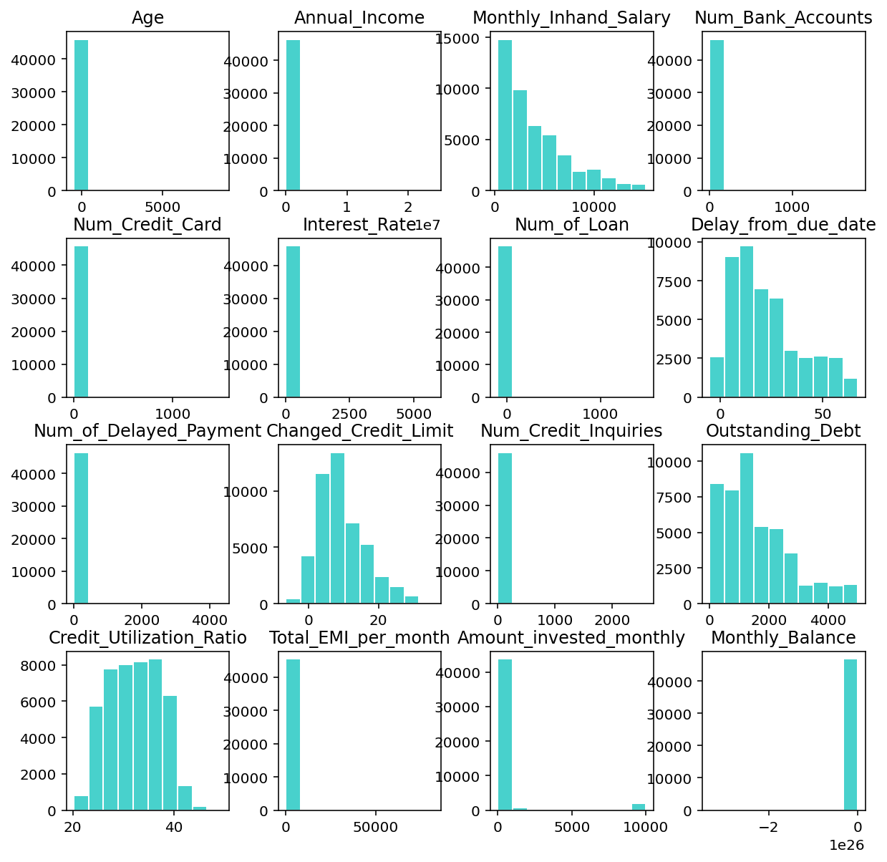
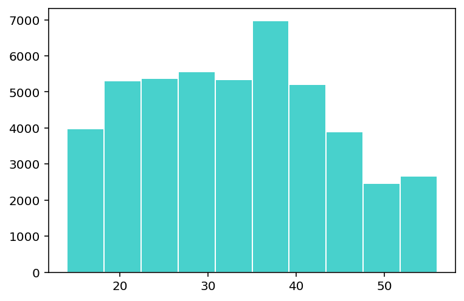
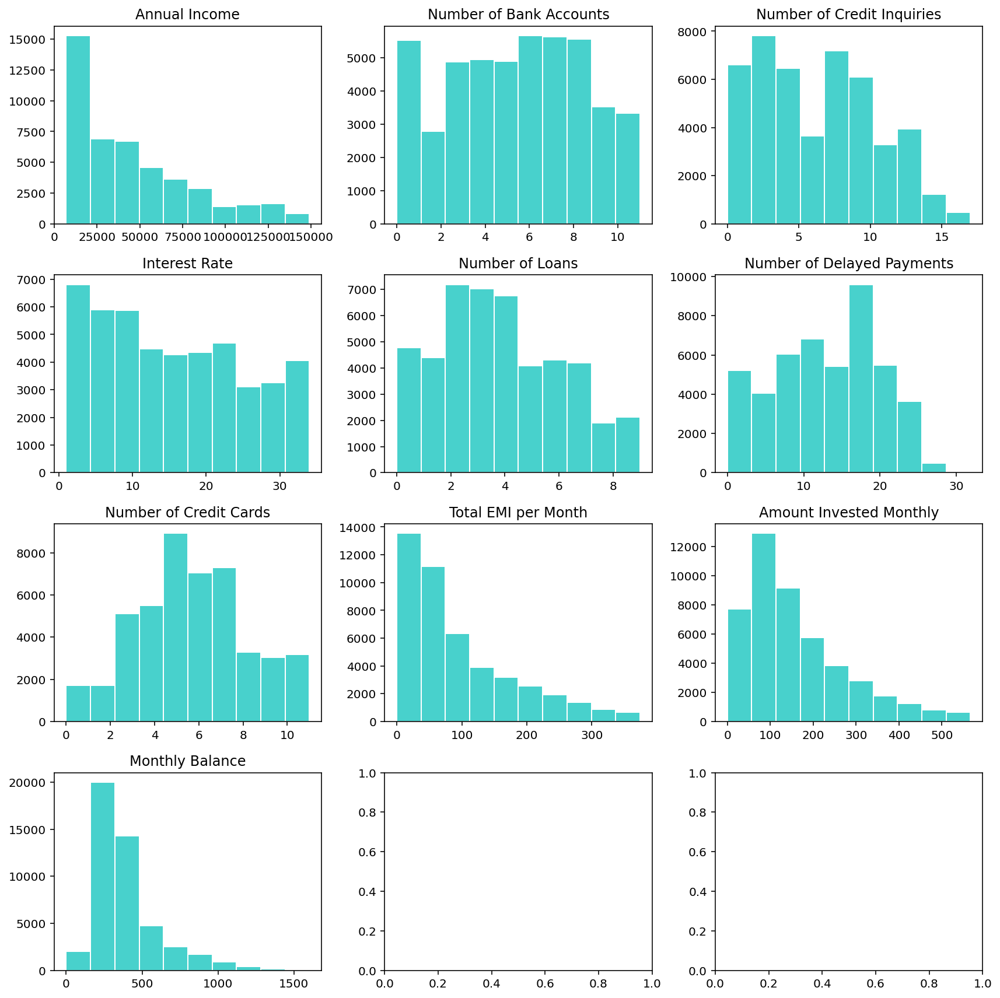

## Introduction

Credit scoring is very crucial part in the financial industry. It can be very helpful for lenders to assess how the borrowers are worth in terms of credit. And it is equally important that steps and processes taken to build credit scoring model should be open and transparent. This way one can ensure that the model is reliable and fair.
In this project, we develop a credit scoring midel using 3 machine learning approaches, to assess which model better predicts the Credit scores. 

Firstly, we describe the dataset used in our study. We obtained Credit scoring dataset from [kaggle](https://www.kaggle.com/datasets/parisrohan/credit-score-classification). Which includes customer's demographics, credit history, income and other relavant features. To ensure transparency we provided detailed data preprocessinf steps that we performed, and steps for resolving missing and outlier values.

Then, to find most relavant features to our model, we use correlation coefficients to decide if we include variable in model for numeric variables. For categorical variable we used ANOVA to asses if variable has association with credit scoring dependent variable.

Next we use Random Forest, AdaBoosting, and Neural Network machine learning algorithms. We specify the hyperparameters, model training processes, to enable other researchesr to replicate our model development process.

##### Importing Neccessary Libraries

Following libraries are used for this project

::: {.cell execution_count=1}
```` { .cell-code}
```{{python}}
import pandas as pd
import re
import numpy as np
from sklearn import preprocessing
from sklearn.preprocessing import scale
import os
import matplotlib.pyplot as plt
from sklearn.model_selection import train_test_split
import scipy.stats as stats
from sklearn.preprocessing import LabelEncoder, OneHotEncoder

from sklearn.model_selection import GridSearchCV
from sklearn.ensemble import RandomForestClassifier
from sklearn.ensemble import AdaBoostClassifier
from sklearn.neural_network import MLPClassifier
from sklearn.metrics import accuracy_score
import datetime
```

````
:::


##### Dataset

Initial dimension of the data had 100'000 rows and 28 variables. 

-   "ID" - Unique identifier
-   "Customer_ID" - Unique identifier of customer
-   "Name" - Name of person
-   "SSN" - Unique identifier
-   "Month" - Month of the year
-   "Age" - Age of the person
-   "Occupation" - Occupation of the person, 16 factor
-   "Annual_Income" - Annual income of the person, continuous variable
-   "Monthly_Inhand_Salary" - Monthly salary, continuous variable
-   "Num_Bank_Accounts" - Num of bank accounts the person holds
-   "Num_Credit_Card" - Num of credit card the person holds
-   "Interest_Rate" - Interest rate on credit card
-   "Num_of_Loan" - Num of loans from the bank
-   "Type_of_Loan" - Type of loan
-   "Delay_from_due_date" - Average number of days delayed from the payment date
-   "Num_of_Delayed_Payment" - Average number of payments delayed by a person
-   "Changed_Credit_Limit" - Percentage change in credit card limit
-   "Num_Credit_Inquiries" - number of credit card inquiries
-   "Credit_Mix" - Classification of the mix of credits
-   "Outstanding_Debt" - remaining debt to be paid (in USD)
-   "Credit_Utilization_Ratio" - utilization ratio of credit card
-   "Credit_History_Age" - age of credit history of the person
-   "Payment_of_Min_Amount" - whether only the minimum amount was paid by the person
-   "Total_EMI_per_month" - monthly EMI payments (in USD)
-   "Amount_invested_monthly" - monthly amount invested by the customer (in USD)
-   "Payment_Behaviour" - payment behavior of the customer
-   "Monthly_Balance" - monthly balance amount of the customer (in USD)
-   "Credit_Score" - bracket of credit score (Poor, Standard, Good)

Our target variable Credit_Score has 3 classes, but we will only work with **"Poor"** and **"Good"** categories to further analysis. So that we are left with **46'826** observations.

::: {.cell execution_count=2}
```` { .cell-code}
```{{python}}
#| warning: false
os.getcwd()
credit_score=pd.read_csv('train.csv')
credit_score=credit_score.drop(['ID','Name','SSN'], axis=1) # remove unnecessary unique identifier columns
credit_score=credit_score[credit_score.Credit_Score!='Standard'] # filter target variable and drop Standard category
print(credit_score.shape)
credit_score.head()
```

````

::: {.cell-output .cell-output-stdout}
```
(46826, 25)
```
:::

::: {.cell-output .cell-output-display execution_count=34}

```{=html}
<div>
<style scoped>
    .dataframe tbody tr th:only-of-type {
        vertical-align: middle;
    }

    .dataframe tbody tr th {
        vertical-align: top;
    }

    .dataframe thead th {
        text-align: right;
    }
</style>
<table border="1" class="dataframe">
  <thead>
    <tr style="text-align: right;">
      <th></th>
      <th>Customer_ID</th>
      <th>Month</th>
      <th>Age</th>
      <th>Occupation</th>
      <th>Annual_Income</th>
      <th>Monthly_Inhand_Salary</th>
      <th>Num_Bank_Accounts</th>
      <th>Num_Credit_Card</th>
      <th>Interest_Rate</th>
      <th>Num_of_Loan</th>
      <th>...</th>
      <th>Credit_Mix</th>
      <th>Outstanding_Debt</th>
      <th>Credit_Utilization_Ratio</th>
      <th>Credit_History_Age</th>
      <th>Payment_of_Min_Amount</th>
      <th>Total_EMI_per_month</th>
      <th>Amount_invested_monthly</th>
      <th>Payment_Behaviour</th>
      <th>Monthly_Balance</th>
      <th>Credit_Score</th>
    </tr>
  </thead>
  <tbody>
    <tr>
      <th>0</th>
      <td>CUS_0xd40</td>
      <td>January</td>
      <td>23</td>
      <td>Scientist</td>
      <td>19114.12</td>
      <td>1824.843333</td>
      <td>3</td>
      <td>4</td>
      <td>3</td>
      <td>4</td>
      <td>...</td>
      <td>_</td>
      <td>809.98</td>
      <td>26.822620</td>
      <td>22 Years and 1 Months</td>
      <td>No</td>
      <td>49.574949</td>
      <td>80.41529543900253</td>
      <td>High_spent_Small_value_payments</td>
      <td>312.49408867943663</td>
      <td>Good</td>
    </tr>
    <tr>
      <th>1</th>
      <td>CUS_0xd40</td>
      <td>February</td>
      <td>23</td>
      <td>Scientist</td>
      <td>19114.12</td>
      <td>NaN</td>
      <td>3</td>
      <td>4</td>
      <td>3</td>
      <td>4</td>
      <td>...</td>
      <td>Good</td>
      <td>809.98</td>
      <td>31.944960</td>
      <td>NaN</td>
      <td>No</td>
      <td>49.574949</td>
      <td>118.28022162236736</td>
      <td>Low_spent_Large_value_payments</td>
      <td>284.62916249607184</td>
      <td>Good</td>
    </tr>
    <tr>
      <th>2</th>
      <td>CUS_0xd40</td>
      <td>March</td>
      <td>-500</td>
      <td>Scientist</td>
      <td>19114.12</td>
      <td>NaN</td>
      <td>3</td>
      <td>4</td>
      <td>3</td>
      <td>4</td>
      <td>...</td>
      <td>Good</td>
      <td>809.98</td>
      <td>28.609352</td>
      <td>22 Years and 3 Months</td>
      <td>No</td>
      <td>49.574949</td>
      <td>81.699521264648</td>
      <td>Low_spent_Medium_value_payments</td>
      <td>331.2098628537912</td>
      <td>Good</td>
    </tr>
    <tr>
      <th>3</th>
      <td>CUS_0xd40</td>
      <td>April</td>
      <td>23</td>
      <td>Scientist</td>
      <td>19114.12</td>
      <td>NaN</td>
      <td>3</td>
      <td>4</td>
      <td>3</td>
      <td>4</td>
      <td>...</td>
      <td>Good</td>
      <td>809.98</td>
      <td>31.377862</td>
      <td>22 Years and 4 Months</td>
      <td>No</td>
      <td>49.574949</td>
      <td>199.4580743910713</td>
      <td>Low_spent_Small_value_payments</td>
      <td>223.45130972736786</td>
      <td>Good</td>
    </tr>
    <tr>
      <th>4</th>
      <td>CUS_0xd40</td>
      <td>May</td>
      <td>23</td>
      <td>Scientist</td>
      <td>19114.12</td>
      <td>1824.843333</td>
      <td>3</td>
      <td>4</td>
      <td>3</td>
      <td>4</td>
      <td>...</td>
      <td>Good</td>
      <td>809.98</td>
      <td>24.797347</td>
      <td>22 Years and 5 Months</td>
      <td>No</td>
      <td>49.574949</td>
      <td>41.420153086217326</td>
      <td>High_spent_Medium_value_payments</td>
      <td>341.48923103222177</td>
      <td>Good</td>
    </tr>
  </tbody>
</table>
<p>5 rows × 25 columns</p>
</div>
```

:::
:::


## Data Preprocessing

We prepared the data set for further analysis step by transforming character variables into categorical/factor variables, and numeric variables, treating missing values, and standardized it and treating outliers.

We have noticed there is some strange values like "_",  "!@9#%8",  "#F%$D@*&8" in dataset. You can check the coding part below for  details.

::: {.cell execution_count=3}
```` { .cell-code}
```{{python}}
def replace_weird(credit_score): # create function for remove _ syntax
    if credit_score is np.NaN or not isinstance(credit_score, str):
        return credit_score
    else:
        return str(credit_score).strip('_ ,"')
credit_score = credit_score.applymap(replace_weird).replace(['', 'nan', '!@9#%8', '#F%$D@*&8'], np.NaN) # replace weird strings with na
```

````
:::


### Treating Missing Data 

Below we can see that there is quite many missing data in our dataset. Removing them would result significant drop in our number of datasets. So that we need to try treating it as much as we can.

::: {.cell execution_count=4}
```` { .cell-code}
```{{python}}
credit_score.isna().sum()
```

````

::: {.cell-output .cell-output-display execution_count=36}
```
Customer_ID                    0
Month                          0
Age                            0
Occupation                  3274
Annual_Income                  0
Monthly_Inhand_Salary       7115
Num_Bank_Accounts              0
Num_Credit_Card                0
Interest_Rate                  0
Num_of_Loan                    0
Type_of_Loan                4780
Delay_from_due_date            0
Num_of_Delayed_Payment      3257
Changed_Credit_Limit        1000
Num_Credit_Inquiries         902
Credit_Mix                  9491
Outstanding_Debt               0
Credit_Utilization_Ratio       0
Credit_History_Age          4206
Payment_of_Min_Amount          0
Total_EMI_per_month            0
Amount_invested_monthly     2155
Payment_Behaviour           3608
Monthly_Balance              595
Credit_Score                   0
dtype: int64
```
:::
:::


Below shows that we have dataset which includes credit scoring history of 8'692 unique customers January to August.  Using Customer_Id, we can replace some feature's missing value of certain customers, if other values are not missing.

::: {.cell execution_count=5}
```` { .cell-code}
```{{python}}
num_customer= len(set(credit_score["Customer_ID"] ))
print("Number of unique customer: ", num_customer)
num_month= set(credit_score["Month"] )
print("Number of month: ", num_month)
```

````

::: {.cell-output .cell-output-stdout}
```
Number of unique customer:  8692
Number of month:  {'May', 'August', 'June', 'April', 'March', 'July', 'January', 'February'}
```
:::
:::


For example, for Customer_ID=CUS_0x2dbc 3 of the value is missing. So instead of removing them we replaced the missing values with other most occured non missing value.

::: {.cell execution_count=6}
```` { .cell-code}
```{{python}}
credit_score[credit_score.Customer_ID=='CUS_0x2dbc'].groupby('Customer_ID')['Occupation'].apply(list)
```

````

::: {.cell-output .cell-output-display execution_count=38}
```
Customer_ID
CUS_0x2dbc    [nan, Engineer, nan, Engineer, nan, Engineer]
Name: Occupation, dtype: object
```
:::
:::


After replacing the missiong value of occupation, above example looks like this.

::: {.cell execution_count=7}
```` { .cell-code code-fold="false"}
```{{python}}
#| code-fold: false
credit_score['Occupation'] = credit_score['Occupation'].fillna(credit_score.groupby('Customer_ID')['Occupation'].transform(lambda x: x.fillna(stats.mode(x)[0][0])))
credit_score[credit_score.Customer_ID=='CUS_0x2dbc'].groupby('Customer_ID')['Occupation'].apply(list)
```

````

::: {.cell-output .cell-output-display execution_count=39}
```
Customer_ID
CUS_0x2dbc    [Engineer, Engineer, Engineer, Engineer, Engin...
Name: Occupation, dtype: object
```
:::
:::


With this method we also replaced missing values of categorical variables, Credit_Mix, Payment_Behaviour, Type_of_Loan.

::: {.cell execution_count=8}
```` { .cell-code}
```{{python}}
credit_score['Credit_Mix'] = credit_score['Credit_Mix'].fillna(credit_score.groupby('Customer_ID')['Credit_Mix'].transform(lambda x: x.fillna(stats.mode(x)[0][0])))
credit_score['Payment_Behaviour'] = credit_score['Payment_Behaviour'].fillna(credit_score.groupby('Customer_ID')['Payment_Behaviour'].transform(lambda x: x.fillna(stats.mode(x)[0][0])))
credit_score['Type_of_Loan'] = credit_score['Type_of_Loan'].fillna(credit_score.groupby('Customer_ID')['Type_of_Loan'].transform(lambda x: x.fillna(stats.mode(x)[0][0])))
# for credit history age we replaced with pervious or next month's value
credit_score['Credit_History_Age'] = credit_score.groupby('Customer_ID')['Credit_History_Age'].apply(lambda x: x.interpolate().bfill().ffill())
```

````
:::


As for numerical variables, we take average of other non missing values.

::: {.cell execution_count=9}
```` { .cell-code}
```{{python}}
credit_score[credit_score.Customer_ID=='CUS_0x1018'].groupby('Customer_ID')['Num_of_Delayed_Payment'].apply(list)
```

````

::: {.cell-output .cell-output-display execution_count=41}
```
Customer_ID
CUS_0x1018    [22, 22, 22, 20, nan, 22, 22, 22]
Name: Num_of_Delayed_Payment, dtype: object
```
:::
:::


After replacing the missiong value of Num_of_Delayed_Payment, above example looks like this.

::: {.cell execution_count=10}
```` { .cell-code code-fold="false"}
```{{python}}
#| code-fold: false
credit_score['Num_of_Delayed_Payment'] = credit_score['Num_of_Delayed_Payment'].fillna(credit_score.groupby('Customer_ID')['Num_of_Delayed_Payment'].transform(lambda x: x.fillna(x.astype('float64').mean())))
credit_score[credit_score.Customer_ID=='CUS_0x1018'].groupby('Customer_ID')['Num_of_Delayed_Payment'].apply(list)
```

````

::: {.cell-output .cell-output-display execution_count=42}
```
Customer_ID
CUS_0x1018    [22, 22, 22, 20, 21.714285714285715, 22, 22, 22]
Name: Num_of_Delayed_Payment, dtype: object
```
:::
:::


And with this method, we do same for Monthly_Inhand_Salary, Changed_Credit_Limit, Num_Credit_Inquiries, Amount_invested_monthly, Monthly_Balance variables.

::: {.cell execution_count=11}
```` { .cell-code}
```{{python}}
credit_score['Monthly_Inhand_Salary'] = credit_score['Monthly_Inhand_Salary'].fillna(credit_score.groupby('Customer_ID')['Monthly_Inhand_Salary'].transform(lambda x: x.fillna(x.astype('float64').mean())))
credit_score['Changed_Credit_Limit'] = credit_score['Changed_Credit_Limit'].fillna(credit_score.groupby('Customer_ID')['Changed_Credit_Limit'].transform(lambda x: x.fillna(x.astype('float64').mean())))
credit_score['Num_Credit_Inquiries'] = credit_score['Num_Credit_Inquiries'].fillna(credit_score.groupby('Customer_ID')['Num_Credit_Inquiries'].transform(lambda x: x.fillna(x.mean())))
credit_score['Amount_invested_monthly'] = credit_score['Amount_invested_monthly'].fillna(credit_score.groupby('Customer_ID')['Amount_invested_monthly'].transform(lambda x: x.fillna(x.astype('float64').mean())))
credit_score['Monthly_Balance'] = credit_score['Monthly_Balance'].fillna(credit_score.groupby('Customer_ID')['Monthly_Balance'].transform(lambda x: x.fillna(x.astype('float64').mean())))
```

````
:::


After missing value treatment we have now left with very few missing value.

::: {.cell execution_count=12}
```` { .cell-code}
```{{python}}
credit_score.isna().sum()
```

````

::: {.cell-output .cell-output-display execution_count=44}
```
Customer_ID                  0
Month                        0
Age                          0
Occupation                   0
Annual_Income                0
Monthly_Inhand_Salary       85
Num_Bank_Accounts            0
Num_Credit_Card              0
Interest_Rate                0
Num_of_Loan                  0
Type_of_Loan                 0
Delay_from_due_date          0
Num_of_Delayed_Payment      33
Changed_Credit_Limit         6
Num_Credit_Inquiries         5
Credit_Mix                   0
Outstanding_Debt             0
Credit_Utilization_Ratio     0
Credit_History_Age          47
Payment_of_Min_Amount        0
Total_EMI_per_month          0
Amount_invested_monthly     19
Payment_Behaviour            0
Monthly_Balance              9
Credit_Score                 0
dtype: int64
```
:::
:::


### Data type
Here we are converting variables into suitable data types numeric or categorical.

::: {.cell execution_count=13}
```` { .cell-code}
```{{python}}
credit_score['Age']=credit_score['Age'].astype('int')
credit_score.Occupation=credit_score.Occupation.astype('category')
credit_score.Annual_Income=credit_score.Annual_Income.astype('float')
credit_score.Monthly_Inhand_Salary=credit_score.Monthly_Inhand_Salary.astype('float')
credit_score.Num_Bank_Accounts=credit_score.Num_Bank_Accounts.astype('float')
credit_score.Num_Credit_Card=credit_score.Num_Credit_Card.astype('float')
credit_score.Interest_Rate=credit_score.Interest_Rate.astype('float')
credit_score.Num_of_Loan=credit_score.Num_of_Loan.astype('int')
credit_score.Num_of_Delayed_Payment=credit_score.Num_of_Delayed_Payment.astype('float')
credit_score.Changed_Credit_Limit=pd.to_numeric(credit_score.Changed_Credit_Limit, errors='coerce')
credit_score.Num_Credit_Inquiries=pd.to_numeric(credit_score.Num_Credit_Inquiries, errors='coerce')
credit_score.Credit_Mix=credit_score.Credit_Mix.astype('category')
credit_score.Outstanding_Debt=pd.to_numeric(credit_score.Outstanding_Debt, errors='coerce')
credit_score.Payment_of_Min_Amount=credit_score.Payment_of_Min_Amount.astype('category')
credit_score.Amount_invested_monthly=pd.to_numeric(credit_score.Amount_invested_monthly, errors='coerce')
credit_score.Credit_Score=credit_score.Credit_Score.astype('category')
credit_score.Monthly_Balance=pd.to_numeric(credit_score.Monthly_Balance, errors='coerce')

```

````
:::


#### Outlier Values
We check each numeric values if there is any outliers or wrong values by drawing the histogram of it and treat it individually. We clearly see below variabeles have outliers or wrong values in it. We will fix it by using 1 and 3rd quantiles to make outlier values NAN and treat it same as the missing values.  

- Age, 
- Annual_Income, 
- Num_Bank_Account, 
- Num_Credit_Card, 
- Interest_Rate, 
- Num_of_Loan, 
- Num_of_Delayed_Payment, 
- Num_Credit_Inquiries, 
- Total_EMI_per_month, 
- Amount_invested_monthly, 
- Monthly_Balance 

::: {.cell execution_count=14}
```` { .cell-code}
```{{python}}
#| warning: false
fig, axis = plt.subplots(4, 4, figsize=(10,10))
credit_score.hist(ax=axis, color = "mediumturquoise", edgecolor="white" , grid=False)
plt.show()
```

````

::: {.cell-output .cell-output-display}
{width=826 height=803}
:::
:::


To identify the outliers in the data set we will use 1st and 3rd quantiles.

::: {.cell execution_count=15}
```` { .cell-code code-fold="false"}
```{{python}}
#| code-fold: false
# function to get 1st and 3rd quantiles
def get_1_3_qr(credit_score, column, multiply=1.5):
    q1 = credit_score[column].quantile(0.25)
    q3 = credit_score[column].quantile(0.75)
    iqr = q3 -q1
    lower = q1-iqr*multiply
    upper = q3+iqr*multiply
    print('Outlier band of', column, ":", lower, ";", upper)
```

````
:::


Taking for example Age variable, we can tell than below 0 and above 69 should be outlier value and we convert such values to NAN and then treat it same as we did for missing values.

::: {.cell execution_count=16}
```` { .cell-code code-fold="false"}
```{{python}}
#| code-fold: false
get_1_3_qr(credit_score, 'Age', multiply=1.5)
credit_score['Age']=credit_score['Age'].apply(lambda x: np.NaN if ((x<0)|(x>69)) else x)
credit_score['Age'] = credit_score['Age'].fillna(credit_score.groupby('Customer_ID')['Age'].transform(lambda x: x.fillna(x.astype('float64').mean())))
plt.hist(credit_score.Age, color = "mediumturquoise", edgecolor="white")
plt.show()
```

````

::: {.cell-output .cell-output-stdout}
```
Outlier band of Age : -3.0 ; 69.0
```
:::

::: {.cell-output .cell-output-display}
{width=583 height=404}
:::
:::


And we fixed the other variables with outliers using the same method.

- First identifying outlier bands: 

::: {.cell execution_count=17}
```` { .cell-code}
```{{python}}
get_1_3_qr(credit_score, 'Annual_Income', multiply=1.5)
get_1_3_qr(credit_score, 'Num_Bank_Accounts', multiply=1.5)
get_1_3_qr(credit_score, 'Num_Credit_Inquiries', multiply=1.5)
get_1_3_qr(credit_score, 'Interest_Rate', multiply=1.5)
get_1_3_qr(credit_score, 'Num_of_Loan', multiply=1.5)
get_1_3_qr(credit_score, 'Num_of_Delayed_Payment', multiply=1.5)
get_1_3_qr(credit_score, 'Num_Credit_Card', multiply=1.5)
get_1_3_qr(credit_score, 'Total_EMI_per_month', multiply=1.5)
get_1_3_qr(credit_score, 'Amount_invested_monthly', multiply=1.5)
get_1_3_qr(credit_score, 'Monthly_Balance', multiply=1.5)
```

````

::: {.cell-output .cell-output-stdout}
```
Outlier band of Annual_Income : -59336.89750000001 ; 149059.0425
Outlier band of Num_Bank_Accounts : -4.5 ; 15.5
Outlier band of Num_Credit_Inquiries : -7.5 ; 20.5
Outlier band of Interest_Rate : -18.5 ; 49.5
Outlier band of Num_of_Loan : -4.0 ; 12.0
Outlier band of Num_of_Delayed_Payment : -8.5 ; 35.5
Outlier band of Num_Credit_Card : -0.5 ; 11.5
Outlier band of Total_EMI_per_month : -170.8962565708198 ; 373.8051122659707
Outlier band of Amount_invested_monthly : -219.46674583295186 ; 565.4620842502486
Outlier band of Monthly_Balance : -21.159846598012678 ; 744.2067826197436
```
:::
:::


- Then replacing outlier variables with NAN:
- Next we replace with mean value of each customers:

::: {.cell execution_count=18}
```` { .cell-code}
```{{python}}
# Replacing with NAN
credit_score['Annual_Income']=credit_score['Annual_Income'].apply(lambda x: np.NaN if ((x<0)|(x>149060)) else x)
credit_score['Num_Bank_Accounts']=credit_score['Num_Bank_Accounts'].apply(lambda x: np.NaN if ((x<0)|(x>16)) else x)
credit_score['Num_Credit_Inquiries']=credit_score['Num_Credit_Inquiries'].apply(lambda x: np.NaN if ((x<0)|(x>21)) else x)
credit_score['Interest_Rate']=credit_score['Interest_Rate'].apply(lambda x: np.NaN if ((x<0)|(x>50)) else x)
credit_score['Num_of_Loan']=credit_score['Num_of_Loan'].apply(lambda x: np.NaN if ((x<0)|(x>12)) else x)
credit_score['Num_of_Delayed_Payment']=credit_score['Num_of_Delayed_Payment'].apply(lambda x: np.NaN if ((x<0)|(x>36)) else x)
credit_score['Num_Credit_Card']=credit_score['Num_Credit_Card'].apply(lambda x: np.NaN if ((x<0)|(x>12)) else x)
credit_score['Total_EMI_per_month']=credit_score['Total_EMI_per_month'].apply(lambda x: np.NaN if ((x<0)|(x>374)) else x)
credit_score['Amount_invested_monthly']=credit_score['Amount_invested_monthly'].apply(lambda x: np.NaN if ((x<0)|(x>567)) else x)
credit_score['Monthly_Balance']=credit_score['Monthly_Balance'].apply(lambda x: np.NaN if (x<0) else x)
# Replacing with mean value of customer
credit_score['Annual_Income'] = credit_score['Annual_Income'].fillna(credit_score.groupby('Customer_ID')['Annual_Income'].transform(lambda x: x.fillna(x.astype('float64').mean())))
credit_score['Num_Bank_Accounts'] = credit_score['Num_Bank_Accounts'].fillna(credit_score.groupby('Customer_ID')['Num_Bank_Accounts'].transform(lambda x: x.fillna(x.astype('float64').mean())))
credit_score['Num_Credit_Inquiries'] = credit_score['Num_Credit_Inquiries'].fillna(credit_score.groupby('Customer_ID')['Num_Credit_Inquiries'].transform(lambda x: x.fillna(x.astype('float64').mean())))
credit_score['Interest_Rate'] = credit_score['Interest_Rate'].fillna(credit_score.groupby('Customer_ID')['Interest_Rate'].transform(lambda x: x.fillna(x.astype('float64').mean())))
credit_score['Num_of_Loan'] = credit_score['Num_of_Loan'].fillna(credit_score.groupby('Customer_ID')['Num_of_Loan'].transform(lambda x: x.fillna(x.astype('float64').mean())))
credit_score['Num_of_Delayed_Payment'] = credit_score['Num_of_Delayed_Payment'].fillna(credit_score.groupby('Customer_ID')['Num_of_Delayed_Payment'].transform(lambda x: x.fillna(x.astype('float64').mean())))
credit_score['Num_Credit_Card'] = credit_score['Num_Credit_Card'].fillna(credit_score.groupby('Customer_ID')['Num_Credit_Card'].transform(lambda x: x.fillna(x.astype('float64').mean())))
credit_score['Total_EMI_per_month'] = credit_score['Total_EMI_per_month'].fillna(credit_score.groupby('Customer_ID')['Total_EMI_per_month'].transform(lambda x: x.fillna(x.astype('float64').mean())))
credit_score['Amount_invested_monthly'] = credit_score['Amount_invested_monthly'].fillna(credit_score.groupby('Customer_ID')['Amount_invested_monthly'].transform(lambda x: x.fillna(x.astype('float64').mean())))
credit_score['Monthly_Balance'] = credit_score['Monthly_Balance'].fillna(credit_score.groupby('Customer_ID')['Monthly_Balance'].transform(lambda x: x.fillna(x.astype('float64').mean())))
```

````
:::


- After treating the outliers, variables distribution looks like this

::: {.cell execution_count=19}
```` { .cell-code}
```{{python}}
figure, axis = plt.subplots(4, 3, figsize=(12, 12))

# Plot histograms
axis[0, 0].hist(credit_score.Annual_Income, color="mediumturquoise", edgecolor="white")
axis[0, 1].hist(credit_score.Num_Bank_Accounts, color="mediumturquoise", edgecolor="white")
axis[0, 2].hist(credit_score.Num_Credit_Inquiries, color="mediumturquoise", edgecolor="white")
axis[1, 0].hist(credit_score.Interest_Rate, color="mediumturquoise", edgecolor="white")
axis[1, 1].hist(credit_score.Num_of_Loan, color="mediumturquoise", edgecolor="white")
axis[1, 2].hist(credit_score.Num_of_Delayed_Payment, color="mediumturquoise", edgecolor="white")
axis[2, 0].hist(credit_score.Num_Credit_Card, color="mediumturquoise", edgecolor="white")
axis[2, 1].hist(credit_score.Total_EMI_per_month, color="mediumturquoise", edgecolor="white")
axis[2, 2].hist(credit_score.Amount_invested_monthly, color="mediumturquoise", edgecolor="white")
axis[3, 0].hist(credit_score.Monthly_Balance, color="mediumturquoise", edgecolor="white")

# Set titles
axis[0, 0].set_title('Annual Income')
axis[0, 1].set_title('Number of Bank Accounts')
axis[0, 2].set_title('Number of Credit Inquiries')
axis[1, 0].set_title('Interest Rate')
axis[1, 1].set_title('Number of Loans')
axis[1, 2].set_title('Number of Delayed Payments')
axis[2, 0].set_title('Number of Credit Cards')
axis[2, 1].set_title('Total EMI per Month')
axis[2, 2].set_title('Amount Invested Monthly')
axis[3, 0].set_title('Monthly Balance')

# Adjust spacing between subplots
figure.tight_layout()

# Display the plot
plt.show()
```

````

::: {.cell-output .cell-output-display}
{width=1142 height=1142}
:::
:::


#### Normalization & Other variables
Other than treating missing or outlier values, we need to convert and change variables to make them appropriate for analsis.

See codes for further changes made to other individual variables.

::: {.cell execution_count=20}
```` { .cell-code}
```{{python}}
# For Credit_History_Age variable, we will interpret it as number of months rather than year and month.
def Month_Converter(x): 
  if pd.notnull(x):
    num1 = int(x.split(' ')[0])
    num2 = int(x.split(' ')[3])
    return (num1*12)+num2
  else:
    return x

credit_score['Credit_History_Age'] = credit_score.Credit_History_Age.apply(lambda x: Month_Converter(x)).astype(float)
# For Month, we interpreted it with numbers rather than month name
credit_score["Month"] = [datetime.datetime.strptime(month, "%B").month for month in credit_score["Month"]]

# For Type_of_Loan we created splitted it into each type of dummy variables
credit_score['Type_of_Loan'] = credit_score['Type_of_Loan'].astype('str').apply(lambda x: x.lower().replace('and ', '').replace(', ', ',').strip() if pd.notna(x) else x)

credit_score['auto'] = np.where(credit_score['Type_of_Loan'].str.contains("auto"),1,0)
credit_score['debt_consolidation'] = np.where(credit_score['Type_of_Loan'].str.contains("debt"),1,0)
credit_score['mortgage'] = np.where(credit_score['Type_of_Loan'].str.contains("mortgage"),1,0)
credit_score['home_equity'] = np.where(credit_score['Type_of_Loan'].str.contains("home"),1,0)
credit_score['personal'] = np.where(credit_score['Type_of_Loan'].str.contains("personal"),1,0)
credit_score['student'] = np.where(credit_score['Type_of_Loan'].str.contains("student"),1,0)
credit_score['credit_builder'] = np.where(credit_score['Type_of_Loan'].str.contains("credit-builder"),1,0)
credit_score['payday'] = np.where(credit_score['Type_of_Loan'].str.contains("payday"),1,0)
credit_score['not_specified'] = np.where(credit_score['Type_of_Loan'].str.contains("not specified"),1,0)

credit_score = credit_score.drop('Type_of_Loan', axis=1)

# Making Payment_Behaviour variable into 2 variable
credit_score['Spent'] = credit_score['Payment_Behaviour'].str.split('_', expand=True)[0].astype('category')
credit_score['Payment'] = credit_score['Payment_Behaviour'].str.split('_', expand=True)[2].astype('category')
label_encoder = LabelEncoder()
credit_score['Payment']=label_encoder.fit_transform(credit_score['Payment']) 
credit_score['Spent']=label_encoder.fit_transform(credit_score['Spent']) 

credit_score = credit_score.drop('Payment_Behaviour', axis=1)
```

````
:::


Then we normalized the numeric variables.

::: {.cell execution_count=21}
```` { .cell-code}
```{{python}}
# Normalization
credit_score.Annual_Income = scale(credit_score.Annual_Income)
credit_score.Monthly_Inhand_Salary = scale(credit_score.Monthly_Inhand_Salary)
credit_score.Num_Bank_Accounts = scale(credit_score.Num_Bank_Accounts)
credit_score.Num_Credit_Card = scale(credit_score.Num_Credit_Card)
credit_score.Interest_Rate = scale(credit_score.Interest_Rate)
credit_score.Num_of_Loan = scale(credit_score.Num_of_Loan)
credit_score.Delay_from_due_date = scale(credit_score.Delay_from_due_date)
credit_score.Num_of_Delayed_Payment = scale(credit_score.Num_of_Delayed_Payment)
credit_score.Changed_Credit_Limit = scale(credit_score.Changed_Credit_Limit)
credit_score.Num_Credit_Inquiries = scale(credit_score.Num_Credit_Inquiries)
credit_score.Outstanding_Debt = scale(credit_score.Outstanding_Debt)
credit_score.Credit_Utilization_Ratio = scale(credit_score.Credit_Utilization_Ratio)
credit_score.Credit_History_Age = scale(credit_score.Credit_History_Age)
credit_score.Total_EMI_per_month = scale(credit_score.Total_EMI_per_month)
credit_score.Amount_invested_monthly = scale(credit_score.Amount_invested_monthly)
credit_score.Monthly_Balance = scale(credit_score.Monthly_Balance)
```

````
:::


::: {.cell execution_count=22}
```` { .cell-code}
```{{python}}
credit_score['Credit_Score']=label_encoder.fit_transform(credit_score['Credit_Score']) 
# Remove missing values, we couldn't treat
credit_score = credit_score.dropna(axis=0, how='any')

print(credit_score.shape)
credit_score.head()
```

````

::: {.cell-output .cell-output-stdout}
```
(44137, 34)
```
:::

::: {.cell-output .cell-output-display execution_count=54}

```{=html}
<div>
<style scoped>
    .dataframe tbody tr th:only-of-type {
        vertical-align: middle;
    }

    .dataframe tbody tr th {
        vertical-align: top;
    }

    .dataframe thead th {
        text-align: right;
    }
</style>
<table border="1" class="dataframe">
  <thead>
    <tr style="text-align: right;">
      <th></th>
      <th>Customer_ID</th>
      <th>Month</th>
      <th>Age</th>
      <th>Occupation</th>
      <th>Annual_Income</th>
      <th>Monthly_Inhand_Salary</th>
      <th>Num_Bank_Accounts</th>
      <th>Num_Credit_Card</th>
      <th>Interest_Rate</th>
      <th>Num_of_Loan</th>
      <th>...</th>
      <th>debt_consolidation</th>
      <th>mortgage</th>
      <th>home_equity</th>
      <th>personal</th>
      <th>student</th>
      <th>credit_builder</th>
      <th>payday</th>
      <th>not_specified</th>
      <th>Spent</th>
      <th>Payment</th>
    </tr>
  </thead>
  <tbody>
    <tr>
      <th>0</th>
      <td>CUS_0xd40</td>
      <td>1</td>
      <td>23.0</td>
      <td>Scientist</td>
      <td>-0.801448</td>
      <td>-0.715537</td>
      <td>-0.83093</td>
      <td>-0.740111</td>
      <td>-1.275923</td>
      <td>0.086548</td>
      <td>...</td>
      <td>0</td>
      <td>0</td>
      <td>1</td>
      <td>1</td>
      <td>0</td>
      <td>1</td>
      <td>0</td>
      <td>0</td>
      <td>0</td>
      <td>2</td>
    </tr>
    <tr>
      <th>1</th>
      <td>CUS_0xd40</td>
      <td>2</td>
      <td>23.0</td>
      <td>Scientist</td>
      <td>-0.801448</td>
      <td>-0.715537</td>
      <td>-0.83093</td>
      <td>-0.740111</td>
      <td>-1.275923</td>
      <td>0.086548</td>
      <td>...</td>
      <td>0</td>
      <td>0</td>
      <td>1</td>
      <td>1</td>
      <td>0</td>
      <td>1</td>
      <td>0</td>
      <td>0</td>
      <td>1</td>
      <td>0</td>
    </tr>
    <tr>
      <th>2</th>
      <td>CUS_0xd40</td>
      <td>3</td>
      <td>23.0</td>
      <td>Scientist</td>
      <td>-0.801448</td>
      <td>-0.715537</td>
      <td>-0.83093</td>
      <td>-0.740111</td>
      <td>-1.275923</td>
      <td>0.086548</td>
      <td>...</td>
      <td>0</td>
      <td>0</td>
      <td>1</td>
      <td>1</td>
      <td>0</td>
      <td>1</td>
      <td>0</td>
      <td>0</td>
      <td>1</td>
      <td>1</td>
    </tr>
    <tr>
      <th>3</th>
      <td>CUS_0xd40</td>
      <td>4</td>
      <td>23.0</td>
      <td>Scientist</td>
      <td>-0.801448</td>
      <td>-0.715537</td>
      <td>-0.83093</td>
      <td>-0.740111</td>
      <td>-1.275923</td>
      <td>0.086548</td>
      <td>...</td>
      <td>0</td>
      <td>0</td>
      <td>1</td>
      <td>1</td>
      <td>0</td>
      <td>1</td>
      <td>0</td>
      <td>0</td>
      <td>1</td>
      <td>2</td>
    </tr>
    <tr>
      <th>4</th>
      <td>CUS_0xd40</td>
      <td>5</td>
      <td>23.0</td>
      <td>Scientist</td>
      <td>-0.801448</td>
      <td>-0.715537</td>
      <td>-0.83093</td>
      <td>-0.740111</td>
      <td>-1.275923</td>
      <td>0.086548</td>
      <td>...</td>
      <td>0</td>
      <td>0</td>
      <td>1</td>
      <td>1</td>
      <td>0</td>
      <td>1</td>
      <td>0</td>
      <td>0</td>
      <td>0</td>
      <td>1</td>
    </tr>
  </tbody>
</table>
<p>5 rows × 34 columns</p>
</div>
```

:::
:::


After done the data preprocessing steps we are left with **44'137** observations. Then we divided the data set into training and testing sample by 7:3 ratio. Testing data set has **13'241** observations and Training data set has **30'896** observations.

::: {.cell execution_count=23}
```` { .cell-code}
```{{python}}
data_test,data_train = train_test_split(credit_score, test_size=0.7, random_state=123)
print("Testing data set: \n", data_test.shape)
print("Training data set: \n",data_train.shape)
```

````

::: {.cell-output .cell-output-stdout}
```
Testing data set: 
 (13241, 34)
Training data set: 
 (30896, 34)
```
:::
:::


## Data Exploration & Feature Selection

In the training dataset, we have 63% of Poor Category and 37% of Good category. Data set is not that imbalanced. So that we will not use sampling methods.

::: {.cell execution_count=24}
```` { .cell-code}
```{{python}}
#| warning: false
f_groups = data_train['Credit_Score'].value_counts()

plt.figure(figsize=(8, 6))
bar_plot = f_groups.plot(kind='bar', color='mediumturquoise', edgecolor='white')
plt.title('Credit Scoring')
plt.xlabel('Category')
plt.ylabel('Count')
for i, count in enumerate(f_groups):
    bar_plot.text(i, count, str(count), ha='center', va='bottom')

plt.show()
```

````

::: {.cell-output .cell-output-display}
{width=684 height=510}
:::
:::


For features of the model, we considered Correlation matrix and Anova to select most correlated and associated variables.

#### Relationship numerical variables
Except for the Month, and Credit_Utilization_Ratio variables every numeric variable has slight to medium relationship with dependent variable. No high correlation is occured. We will exclude Month and Credit_Utilization_Ratio variables from model.

::: {.cell execution_count=25}
```` { .cell-code}
```{{python}}
numerics = ['int16', 'int32', 'int64', 'float16', 'float32', 'float64']

data_num = data_train.select_dtypes(include=numerics)
num_cors=data_num.corr()
correlation_with_dep = num_cors['Credit_Score']
print(correlation_with_dep.sort_values(ascending=False) )
```

````

::: {.cell-output .cell-output-stdout}
```
Credit_Score                1.000000
Interest_Rate               0.630503
Num_Credit_Inquiries        0.585765
Delay_from_due_date         0.551923
Num_Bank_Accounts           0.538719
Outstanding_Debt            0.537738
Num_Credit_Card             0.536354
Num_of_Delayed_Payment      0.519820
Num_of_Loan                 0.496401
Changed_Credit_Limit        0.293260
auto                        0.210494
personal                    0.203107
payday                      0.196844
mortgage                    0.195386
credit_builder              0.194996
debt_consolidation          0.193754
home_equity                 0.191103
student                     0.188193
not_specified               0.178540
Spent                       0.144263
Payment                     0.132471
Total_EMI_per_month         0.114227
Month                      -0.023726
Credit_Utilization_Ratio   -0.060603
Amount_invested_monthly    -0.155742
Age                        -0.244833
Monthly_Inhand_Salary      -0.284578
Annual_Income              -0.287677
Monthly_Balance            -0.293342
Credit_History_Age         -0.565886
Name: Credit_Score, dtype: float64
```
:::
:::


#### Relationship between categorical variables
For categorical variables, all variables have significant association with dependent variable. 

::: {.cell execution_count=26}
```` { .cell-code}
```{{python}}
categor = ['category']
data_cate = data_train.select_dtypes(include=categor)

# Perform chi-square tests for each variable
Var=[]
Chisq=[]
Pval=[]
for var in data_cate:
    
    data_cate_ = pd.crosstab(data_train['Credit_Score'], data_cate[var])
    chi2, p_value, _, _ = stats.chi2_contingency(data_cate_)

    Var.append(var)
    Chisq.append(chi2)
    Pval.append(p_value)

anova= pd.DataFrame({'Var': Var, 'Chisq': Chisq, 'Pval': Pval})
anova.sort_values(by="Chisq",ascending=False)
```

````

::: {.cell-output .cell-output-display execution_count=58}

```{=html}
<div>
<style scoped>
    .dataframe tbody tr th:only-of-type {
        vertical-align: middle;
    }

    .dataframe tbody tr th {
        vertical-align: top;
    }

    .dataframe thead th {
        text-align: right;
    }
</style>
<table border="1" class="dataframe">
  <thead>
    <tr style="text-align: right;">
      <th></th>
      <th>Var</th>
      <th>Chisq</th>
      <th>Pval</th>
    </tr>
  </thead>
  <tbody>
    <tr>
      <th>1</th>
      <td>Credit_Mix</td>
      <td>14530.692193</td>
      <td>0.000000e+00</td>
    </tr>
    <tr>
      <th>2</th>
      <td>Payment_of_Min_Amount</td>
      <td>12817.402795</td>
      <td>0.000000e+00</td>
    </tr>
    <tr>
      <th>0</th>
      <td>Occupation</td>
      <td>72.440339</td>
      <td>1.635952e-09</td>
    </tr>
  </tbody>
</table>
</div>
```

:::
:::


## Models
Now that we have cleaned and analyzed which variables have relationships and associations with dependent variable, we will build our machine learning models on the training dataset and validate and compare them with Accuracy on testing dataset. Before that we have 3 variables with more than 2 categories, we will make this variable into multiple dummy variables.

::: {.cell execution_count=27}
```` { .cell-code}
```{{python}}
# Making categorical variables into multiple dummies
data_train = pd.get_dummies(data_train, columns = ['Occupation','Credit_Mix','Payment_of_Min_Amount'])
data_test = pd.get_dummies(data_test, columns = ['Occupation','Credit_Mix','Payment_of_Min_Amount'])

# also we need to drop some unneccessary variables
columns_to_drop = ['Customer_ID', 'Month', 'Credit_Utilization_Ratio']

# Drop the specified columns
data_train = data_train.drop(columns_to_drop, axis=1)
data_test = data_test.drop(columns_to_drop, axis=1)
```

````
:::


Then we need to split dependent and independent variables into separate tables.

::: {.cell execution_count=28}
```` { .cell-code}
```{{python}}
xtrain=data_train.drop(['Credit_Score'],axis=1) 
ytrain=data_train['Credit_Score']
xtest=data_test.drop(['Credit_Score'],axis=1)
ytest=data_test['Credit_Score']
```

````
:::


As mentioned we will use Accuracy value to validate and compare the results of models

::: {.cell execution_count=29}
```` { .cell-code}
```{{python}}
# function to calculate accuracy
def evaluate(model, test_features, test_labels): 
  predictions = model.predict(test_features)
  errors = abs(predictions - test_labels)
  mape = 100 * np.mean(errors / test_labels)
  accuracy = 100 - mape
  print('Model Performance')
  print('Average Error: {:0.4f} degrees.'.format(np.mean(errors)))
  print('Accuracy = {:0.2f}%.'.format(accuracy))
  return accuracy
```

````
:::


### Model Estimation
::: {.panel-tabset}

For each models you can see the grid of hyperparameters we searched and optimal hyperparameter in that space and Accuracy of the model on testing data set.
Prediction results of the models shows that Random Forest and Neural Network Models accuracy is similiar around 87% and AdaBoost's accuracy was lower, 84% compared to the other 2 models.

#### Random Forest Model

::: {.cell execution_count=30}
```` { .cell-code}
```{{python}}
#| warning: false
rfc=RandomForestClassifier(random_state=123) # train model
param_grid = {  # grid search space
    'n_estimators': [10, 20],
    'max_features': ['sqrt', 'log2'],
    'max_depth' : [3,6],
    'criterion' :['gini', 'entropy']
}
print("HyperParameter Search Space: \n",param_grid)

CV_rfc = GridSearchCV(estimator=rfc, param_grid=param_grid, cv= 5) # cross validtion
CV_rfc.fit(xtrain, ytrain) # train model using train set
best_params_=CV_rfc.best_params_ # best hyperparameters

print("Optimal Hyperparameter Choosen: \n", best_params_)

rfc1=RandomForestClassifier(random_state=42,  # train model with hyperparameters
                            max_features=CV_rfc.best_estimator_.max_features,
                            n_estimators= CV_rfc.best_estimator_.n_estimators, 
                            max_depth=CV_rfc.best_estimator_.max_depth, 
                            criterion=CV_rfc.best_estimator_.criterion)
rfc1.fit(xtrain, ytrain.values.ravel()) # train model with train set
pred=rfc1.predict(xtest) # predict test target value

print("Accuracy of Test Dataset from Random Forest Model: \n", accuracy_score(ytest,pred))
#accuracy_score(ytest,pred) # accuracy
```

````

::: {.cell-output .cell-output-stdout}
```
HyperParameter Search Space: 
 {'n_estimators': [10, 20], 'max_features': ['sqrt', 'log2'], 'max_depth': [3, 6], 'criterion': ['gini', 'entropy']}
Optimal Hyperparameter Choosen: 
 {'criterion': 'gini', 'max_depth': 6, 'max_features': 'sqrt', 'n_estimators': 20}
Accuracy of Test Dataset from Random Forest Model: 
 0.8691186466278982
```
:::
:::


#### AdaBoost

::: {.cell execution_count=31}
```` { .cell-code}
```{{python}}
#| warning: false
adb=AdaBoostClassifier(random_state=123) # train model
param_grid = {  # grid search space
    'n_estimators': [10, 20,30],
    'learning_rate': [0.01,0.1]
}
print("HyperParameter Search Space: \n",param_grid)

CV_adb = GridSearchCV(estimator=adb, param_grid=param_grid, cv= 5) # cross validation
CV_adb.fit(xtrain, ytrain.values.ravel()) # train model using train set
best_params_=CV_adb.best_params_ # best hyperparameters
print("Best Hyperparameter Choosen: \n", best_params_)
adb=AdaBoostClassifier(random_state=42,  # train model with hyperparameters
                            learning_rate=CV_adb.best_estimator_.learning_rate,
                            n_estimators= CV_adb.best_estimator_.n_estimators)
adb.fit(xtrain, ytrain.values.ravel()) # train mdel with train set
pred=adb.predict(xtest) # predict test target value
print("Accuracy of Test Dataset from AdaBoost Model: \n", accuracy_score(ytest,pred))
 # accuracy
```

````

::: {.cell-output .cell-output-stdout}
```
HyperParameter Search Space: 
 {'n_estimators': [10, 20, 30], 'learning_rate': [0.01, 0.1]}
Best Hyperparameter Choosen: 
 {'learning_rate': 0.1, 'n_estimators': 30}
Accuracy of Test Dataset from AdaBoost Model: 
 0.8434408277320444
```
:::
:::


#### Neural Network

::: {.cell execution_count=32}
```` { .cell-code}
```{{python}}
#| warning: false
nnm=MLPClassifier(random_state=123) # train model
param_grid = { # grid search space
    'hidden_layer_sizes': [(50,30,30)],
    'max_iter': [1, 3, 5],
    'activation': ['tanh', 'relu'],
    'solver': ['sgd', 'adam'],
    'alpha': [0.01, 0.05,0.001],
    'learning_rate': ['constant','adaptive'],
}
print("HyperParameter Search Space: \n",param_grid)

CV_nnm = GridSearchCV(nnm, param_grid, n_jobs= -1, cv=5) # cross validation
CV_nnm.fit(xtrain, ytrain.values.ravel()) # train model using train set
best_params_=CV_nnm.best_params_ # best hyperparameters
print("Best Hyperparameter Choosen: \n", best_params_)
nnm=MLPClassifier(random_state=42,  # train model with best hyperprameters
                   hidden_layer_sizes=CV_nnm.best_estimator_.hidden_layer_sizes,
                   activation=CV_nnm.best_estimator_.activation,
                   solver=CV_nnm.best_estimator_.solver,
                   max_iter=CV_nnm.best_estimator_.max_iter)
nnm.fit(xtrain, ytrain.values.ravel()) # train model with train set
pred=nnm.predict(xtest) # predict test target value
print("Accuracy of Test Dataset from Neural Network Model: \n", accuracy_score(ytest,pred))
 # accuracy
```

````

::: {.cell-output .cell-output-stdout}
```
HyperParameter Search Space: 
 {'hidden_layer_sizes': [(50, 30, 30)], 'max_iter': [1, 3, 5], 'activation': ['tanh', 'relu'], 'solver': ['sgd', 'adam'], 'alpha': [0.01, 0.05, 0.001], 'learning_rate': ['constant', 'adaptive']}
Best Hyperparameter Choosen: 
 {'activation': 'tanh', 'alpha': 0.001, 'hidden_layer_sizes': (50, 30, 30), 'learning_rate': 'constant', 'max_iter': 5, 'solver': 'adam'}
Accuracy of Test Dataset from Neural Network Model: 
 0.8719885205044936
```
:::
:::


:::

For each models you can see the grid of hyperparameters we searched and optimal hyperparameter in that space and Accuracy of the model on testing data set.
Prediction results of the models shows that Random Forest and Neural Network Models accuracy is similiar around 87% and AdaBoost's accuracy was lower, 84% compared to the other 2 models.

## Conclusion

In this project, we used 3 machine learning approaches to construct a credit scoring model and determine which model provides better prediction for credit scores. To uphold transparency, we detailed every steps we taken for data preprocessing. To identify relevant features to our model, we employed correlation coefficient for numeric variable, and ANOVA for categorical variables to determine relationships and associations. Lastly we employed Random Forest, Adaboost, Neural Network models. We specified the hyperparameters so that other researchers can replicate our model. Based on the model prediction, Random Forest and Neural Networking model was equally good for credit scoring. Adaboost was least predictive out of the 3 models. 

